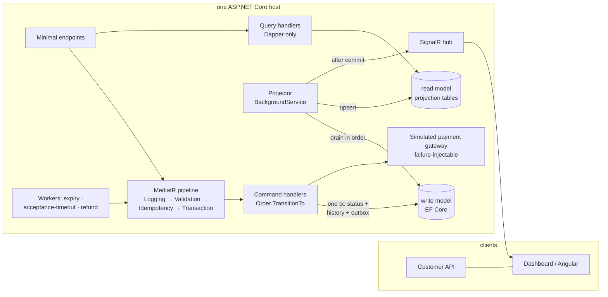

# Ordering — CQRS restaurant ordering in .NET 8

A portfolio re-implementation of a restaurant-ordering domain I first built as
an event-driven TypeScript monolith (x402-food). This repo is the counterpart:
the **same domain, rebuilt CQRS-first in .NET, where the architecture is the
deliverable**. Customers place, confirm, and cancel orders; a restaurant
dashboard accepts, prepares, and completes them; a refund lifecycle with retry
and a terminal manual-intervention state handles rejections.

## Why this domain genuinely earns CQRS

Accept/reject/prepare/complete/refund are naturally **commands** — each is a
guarded state transition with side effects. The kitchen dashboard is naturally
**queries** — denormalized, read-heavy, latency-tolerant, and pushed live. The
two sides have different shapes, different consistency needs, and different
scaling characteristics, so splitting them is a decision the domain makes, not
a pattern applied for its own sake:

- **Write model** (EF Core + PostgreSQL): normalized orders with snapshotted
  line items, a status-history table, and an outbox — optimized for guarded
  transitions in single transactions.
- **Read model** (Dapper over denormalized projection tables): exactly what the
  board and drawer render, built by a projector draining the outbox in order,
  then broadcast over SignalR. Query handlers never touch the DbContext.



## The state machine is law

A transition is valid only if the `(from, to, actor)` tuple exists in the table
below — including the actor, which is derived from which surface was called
(customer endpoints, dashboard endpoints, workers), never from request
payloads. Invalid or repeated transitions return the current state with **no
side effects**. `Order.TransitionTo` is the only code path that changes a
status, and every applied transition writes three things in one transaction:
the status, a history row, and an outbox event.

| From | To | Actor | Trigger |
|---|---|---|---|
| (none) | draft | customer | place (reprice, snapshot, lock total, set expiry) |
| draft | paid | system | confirm → gateway charge succeeded |
| draft | cancelled | customer | cancel before payment |
| draft | expired | system | expiry worker, TTL elapsed |
| paid | accepted / rejected | restaurant | dashboard |
| paid | rejected | system | acceptance-timeout worker |
| accepted | preparing | restaurant | dashboard |
| preparing | ready | restaurant | dashboard |
| ready | completed | restaurant | dashboard |
| rejected | refund_pending | system | automatic, same transaction as the rejection |
| refund_pending | refunded | system | refund worker, gateway refund succeeded |
| refund_pending | refund_failed | system | retries exhausted → manual-intervention flag |

## Where MediatR earns its keep

Four pipeline behaviors, in a deliberate order:

1. **Logging** — request name, duration, outcome. Everything is observed.
2. **Validation** (FluentValidation) — bad input short-circuits as 400
   problem+json before anything touches the database.
3. **Idempotency** — commands marked `IIdempotentCommand` resolve replays
   before a transaction ever opens. The fast path is a lookup; the guarantee
   is a unique constraint, and a lost race replays the winner's response.
4. **Transaction** — opens the DB transaction around command handlers only
   (queries are not `ICommandBase` and never open a write transaction). This is
   what makes "three writes, one transaction" structural rather than
   disciplined: handlers physically cannot commit a transition piecemeal.

Ordering rationale: log everything including rejects; refuse garbage before
spending I/O; answer replays without doing work; only then pay for a
transaction.

## Hard guarantees (each encoded in `tests/…/Invariants`)

- **The server is the only pricing authority.** The place request has no price
  fields; injected ones are ignored. Every line is repriced from the current
  menu, modifier deltas applied, snapshots and total locked at draft creation
  — later menu edits change nothing.
- **Idempotency on every mutating surface.** Place is keyed on
  `Idempotency-Key` + customer with a DB unique constraint (a 3-way concurrent
  race converges on one order in the tests). Confirm is keyed on the charge id
  at the constraint level, and the order id doubles as the gateway idempotency
  key — a replayed confirm settles nothing. Transitions are idempotent via the
  state-machine table.
- **Two-phase ordering.** Placing is free; money moves only at confirm.
  Refunds are not reversals: they're a separate gateway operation owned by a
  background worker with exponential backoff (base·2ⁿ, capped), ending either
  in `refunded` or terminal `refund_failed` with a dashboard-visible
  manual-intervention flag.
- **Guardrails key on the customer id** (the only identity in the system): a
  global max order value and a daily cumulative spend cap, enforced at draft
  creation and re-checked at confirm.
- **Money is integers.** Minor units stored as `long`, serialized as strings
  everywhere (API, outbox payloads, SignalR). No `decimal` or `double`
  anywhere; the Angular app keeps money as strings and formats in exactly one
  pipe.

## Eventual consistency, embraced

The read model lags the write model by design (a polling projector, ~hundreds
of ms). The demo script makes this visible: the first poll after a rejection
can still show `paid`. The dashboard is built for it — SignalR events patch the
board in place, a rejected transition or reconnect triggers a full re-sync, and
a not-yet-projected order is a plain 404 rather than a fallback read against
the write model. The Angular app validates every payload (REST and SignalR)
with Zod at the boundary before it touches state.

## Run it

```bash
docker compose up -d               # postgres (host port 5441)
dotnet ef database update -p src/Ordering.Infrastructure -s src/Ordering.Api
dotnet run --project src/Ordering.Api    # API + SignalR + projector + workers, one host
                                         # (seeds demo restaurants on first boot)
dotnet test                        # 39 unit + 30 integration/invariant tests (Testcontainers)
cd frontend && npm start           # dashboard on http://localhost:4200
./scripts/demo.sh                  # place → confirm → reject → refund with 2 injected
                                   # gateway failures → recovered refund, live on the board
```

Requires .NET 8 SDK, Docker, Node 24. No auth by design — `X-Customer-Id` is
the only principal; that's out of scope on purpose.

## What I'd change for production

Honest deltas between this demo and something I'd run for money:

- **Real identity and authorization.** The customer-id header and the
  unscoped dashboard are demo affordances; every surface needs authn/z.
- **Gateway calls inside the command transaction** (confirm, refund) hold a
  row lock across a network call. Production would record intent, release the
  transaction, call the gateway, and reconcile — an extra state or a
  charge/refund attempt table.
- **Projector throughput.** A single polling projector is the simplest thing
  that preserves ordering. At scale: `LISTEN/NOTIFY` or logical decoding to
  kill the poll loop, per-order partitioning for parallelism, and a
  dead-letter path for poison messages instead of log-and-skip.
- **Outbox retention** needs a pruning job; processed rows currently
  accumulate forever.
- **A broker** (the README-sentence version): swap the projector's table scan
  for publishing to a broker if other services ever need the events. The
  outbox pattern stays identical, which is why no broker exists here.
- **Observability**: the LoggingBehavior would become OpenTelemetry traces +
  metrics; workers need liveness gauges (outbox lag, refund queue depth).
- **Money as `long` minor units in one implied currency** would grow a
  currency code the moment more than one exists.

## Repo conventions

`CLAUDE.md` is the enforcement layer for the design (state machine, invariants,
anti-patterns); `docs/DESIGN.md` is the original build plan;
`docs/DECISIONS.md` records judgment calls; `docs/HANDOFF.md` is the
session-to-session log. The invariant test suite is the contract — later
changes must not weaken it.
