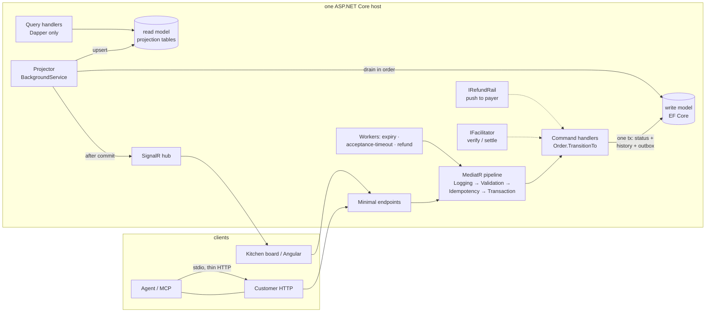

# Ordering — x402 merchant, CQRS-first, in .NET 10

A demo x402 merchant for restaurant ordering. Same domain as the TypeScript
prototype (`x402-food`), rebuilt in .NET 10 LTS so the architecture is
load-bearing: MediatR pipeline, EF write / Dapper read, then a real HTTP 402
handshake, a facilitator, and a C# MCP adapter.

Three seeded shops (Pixel Pizza, Noodle Nexus, Burger Bureau), one API, one
`payTo`, one Angular kitchen board. An agent discovers, drafts, and pays via
MCP; the kitchen runs the order on the dashboard. Nobody onboarded a real
restaurant.

**Stack:** .NET 10 LTS · ASP.NET Core minimal APIs · MediatR + FluentValidation ·
EF Core / PostgreSQL write model · Dapper read projections · SignalR · x402
exact scheme (USDC, Base Sepolia) · C# MCP (stdio) · Angular 22 (standalone,
signals, Zod at the wire). One host — no broker, no extra services.

## Why this domain genuinely earns CQRS

Accept/reject/prepare/complete/refund are naturally **commands** — each is a
guarded state transition with side effects. The kitchen dashboard is naturally
**queries** — denormalized, read-heavy, latency-tolerant, and pushed live. The
two sides have different shapes, different consistency needs, and different
scaling characteristics, so splitting them is a decision the domain makes, not
a pattern applied for its own sake:

- **Write model** (EF Core + PostgreSQL): normalized orders with snapshotted
  line items, a status-history table, a payments table, and an outbox —
  optimized for guarded transitions in single transactions.
- **Read model** (Dapper over denormalized projection tables): exactly what the
  board and drawer render, built by a projector draining the outbox in order,
  then broadcast over SignalR. Query handlers never touch the DbContext.



Place and cancel are free customer HTTP (`X-Customer-Id`). Confirm is the
**only** 402-gated call. MCP is a thin HTTP client of that surface — not
MediatR, not DbContext. The board never pays.

## The state machine is law

A transition is valid only if the `(from, to, actor)` tuple exists in the table
below — including the actor, which is derived from which surface was called
(customer HTTP / MCP, dashboard, workers/settlement), never from request
payloads. Invalid or repeated transitions return the current state with **no
side effects**. `Order.TransitionTo` is the only code path that changes a
status, and every applied transition writes three things in one transaction:
the status, a history row, and an outbox event.

| From | To | Actor | Trigger |
|---|---|---|---|
| (none) | draft | customer | place (reprice, snapshot, lock total, set expiry) |
| draft | paid | system | confirm: facilitator-verified settlement |
| draft | cancelled | customer | cancel before payment |
| draft | expired | system | expiry worker, TTL elapsed |
| paid | accepted / rejected | restaurant | dashboard |
| paid | rejected | system | acceptance-timeout worker |
| accepted | preparing | restaurant | dashboard |
| preparing | ready | restaurant | dashboard |
| ready | completed | restaurant | dashboard |
| rejected | refund_pending | system | automatic, same transaction as the rejection |
| refund_pending | refunded | system | refund worker: outbound transfer to the recorded payer |
| refund_pending | refund_failed | system | retries exhausted → manual-intervention flag |

## Where MediatR earns its keep

Four pipeline behaviors, in a deliberate order:

1. **Logging** — request name, duration, outcome. Everything is observed.
2. **Validation** (FluentValidation) — bad input short-circuits as 400
   problem+json before anything touches the database.
3. **Idempotency** — commands marked `IIdempotentCommand` resolve replays
   before a transaction ever opens. The fast path is a lookup; the guarantee
   is a unique constraint, and a lost race replays the winner's response.
4. **Transaction** — opens the DB transaction around command handlers only
   (queries are not `ICommandBase` and never open a write transaction). This is
   what makes "three writes, one transaction" structural rather than
   disciplined: handlers physically cannot commit a transition piecemeal.

Confirm's facilitator I/O is **not** an `ICommand`: verify/settle run outside
the write transaction that holds `FOR UPDATE`. `recordSettlement` then
transitions `draft → paid`.

## Hard guarantees (each encoded in `tests/…/Invariants`)

- **The server is the only pricing authority.** The place request has no price
  fields; injected ones are ignored. The 402 challenge is built from the
  **locked** total (USDC 6-decimal atomic = cents × 10_000 at 1:1).
- **Two-phase ordering; only confirm is 402-gated.** No `X-PAYMENT` → HTTP 402
  with x402 `accepts[]` (not ProblemDetails). Header present → verify →
  payer-keyed daily cap → settle → payment row → `draft → paid`. A replayed
  payment returns the original success and never hits the facilitator again.
- **Idempotency on every mutating surface.** Place is keyed on
  `Idempotency-Key` + customer. Settlement is keyed on payload hash / tx hash
  at the DB constraint. MCP must pass the client's idempotency key through; it
  must not generate one.
- **Refunds are a new outbound transfer** to the recorded payer wallet, not an
  undo of settlement. The refund worker retries with exponential backoff
  (base·2ⁿ, capped) and ends in `refunded` or terminal `refund_failed` with a
  dashboard-visible manual-intervention flag.
- **Guardrails.** Max-order at draft and confirm. Daily cap at confirm keys on
  the **verified payer wallet**, not `X-Customer-Id`. `GET /api/guardrails`
  publishes the limits so an agent can size a basket before drafting.
- **Money is integers.** Domain amounts are USD cents (`long`), serialized as
  strings. Display happens at one Angular pipe and one MCP format helper.

## Eventual consistency, embraced

The read model lags the write model by design (a polling projector, ~hundreds
of ms). The demo script makes this visible: the first poll after payment can
still show `draft`. The dashboard is built for it — SignalR events patch the
board in place, a rejected transition or reconnect triggers a full re-sync, and
a not-yet-projected order is a plain 404 rather than a fallback read against
the write model. The Angular app validates every payload (REST and SignalR)
with Zod at the boundary before it touches state.

## Run it

```bash
docker compose up -d               # postgres (host port 5441)
dotnet ef database update -p src/Ordering.Infrastructure -s src/Ordering.Api
dotnet run --project src/Ordering.Api    # API + SignalR + projector + workers, one host
                                         # (seeds demo restaurants on first boot)
dotnet test                        # unit + integration/invariants (Testcontainers)
cd frontend && npm start           # kitchen board on http://localhost:4200
./scripts/demo.sh                  # MCP tools + fake facilitator:
                                   # place → 402 → pay → replay → reject →
                                   # two refund-rail failures → refunded
dotnet run --project src/Ordering.Mcp            # stdio MCP → API_URL
dotnet run --project src/Ordering.Mcp -- demo    # same story as demo.sh
```

MCP env: `API_URL` (default `http://localhost:5240`), `CUSTOMER_ID` (default
`mcp-agent`), `X402_FAKE_PAYER` (answers 402 against the fake facilitator).

Requires the .NET 10 SDK (`global.json` pins 10.0.x), Docker, and Node 24.
No auth by design — place/cancel use `X-Customer-Id`; settlement identity is
the verified payer wallet.

Tests and the demo run against a **fake facilitator** (fail N then succeed).
Hitting `https://x402.org/facilitator` on Base Sepolia is optional smoke, not
merge criteria.

GitHub Actions (`.github/workflows/ci.yml`) runs on every push and pull
request: `dotnet build` + `dotnet test` (Testcontainers Postgres; no
docker-compose), and `npm ci` + `ng build` for the dashboard. It does not
run `scripts/demo.sh` (needs a live API host) or `ng test` (no component
specs).

## What I'd change for production

Honest deltas between this demo and something I'd run for money:

- **Real identity and authorization.** The customer-id header and the
  unscoped dashboard are demo affordances; every surface needs authn/z.
- **A real x402 buyer signer** on the MCP paying seam (`AGENT_PRIVATE_KEY`).
  Tests/demo use `X402_FAKE_PAYER`; live Base Sepolia is optional smoke.
- **Refund I/O inside the command transaction** still holds a row lock across
  the (currently in-process) fake rail. A chain client would record intent,
  release `FOR UPDATE`, transfer, and reconcile — the same split confirm
  already uses for the facilitator.
- **Projector throughput.** A single polling projector is the simplest thing
  that preserves ordering. At scale: `LISTEN/NOTIFY` or logical decoding to
  kill the poll loop, per-order partitioning for parallelism, and a
  dead-letter path for poison messages instead of log-and-skip.
- **Outbox retention** needs a pruning job; processed rows currently
  accumulate forever.
- **A broker** (the README-sentence version): swap the projector's table scan
  for publishing to a broker if other services ever need the events. The
  outbox pattern stays identical, which is why no broker exists here.
- **Observability**: the LoggingBehavior would become OpenTelemetry traces +
  metrics; workers need liveness gauges (outbox lag, refund queue depth).
- **Money as `long` minor units in one implied currency** would grow a
  currency code the moment more than one exists.

## Repo conventions

The invariant test suite is the contract — later changes must not weaken it.
`docs/DESIGN.md` is the original CQRS superprompt (historical: simulated
gateway). The live target is an x402 merchant; when they disagree, the code
and the invariant tests win.
